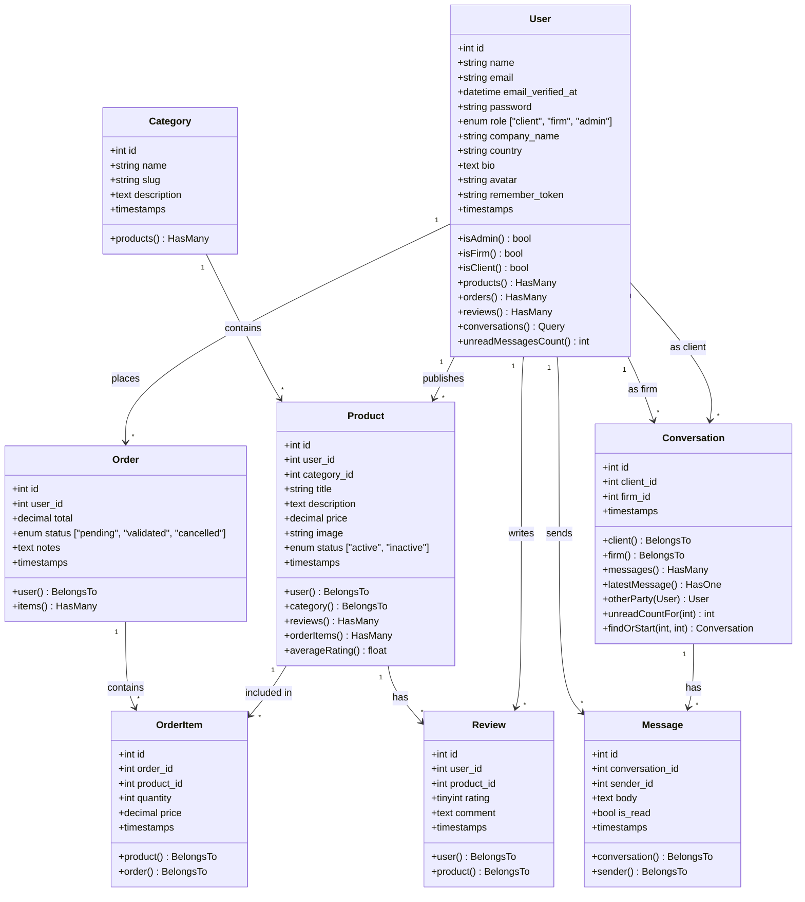
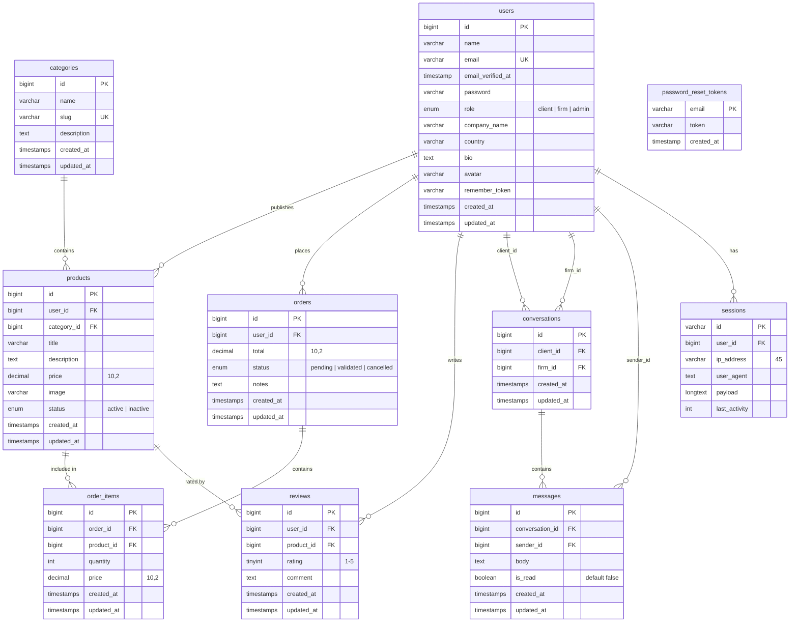
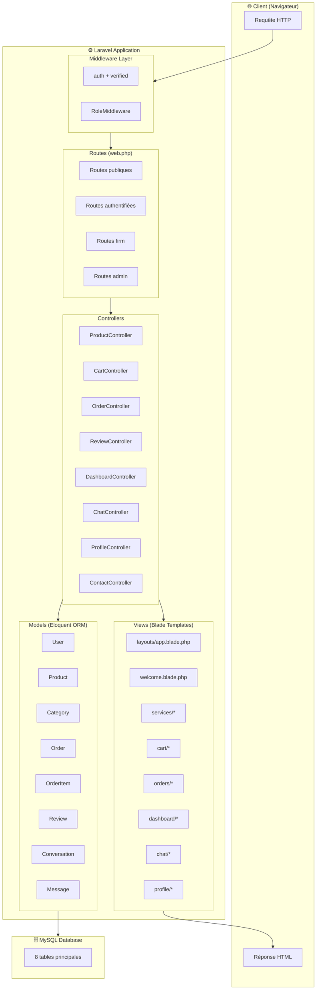
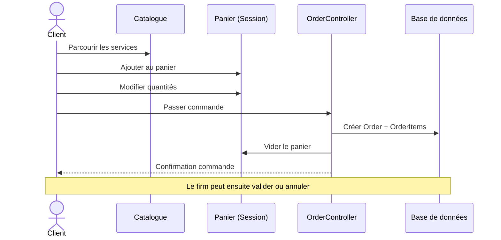
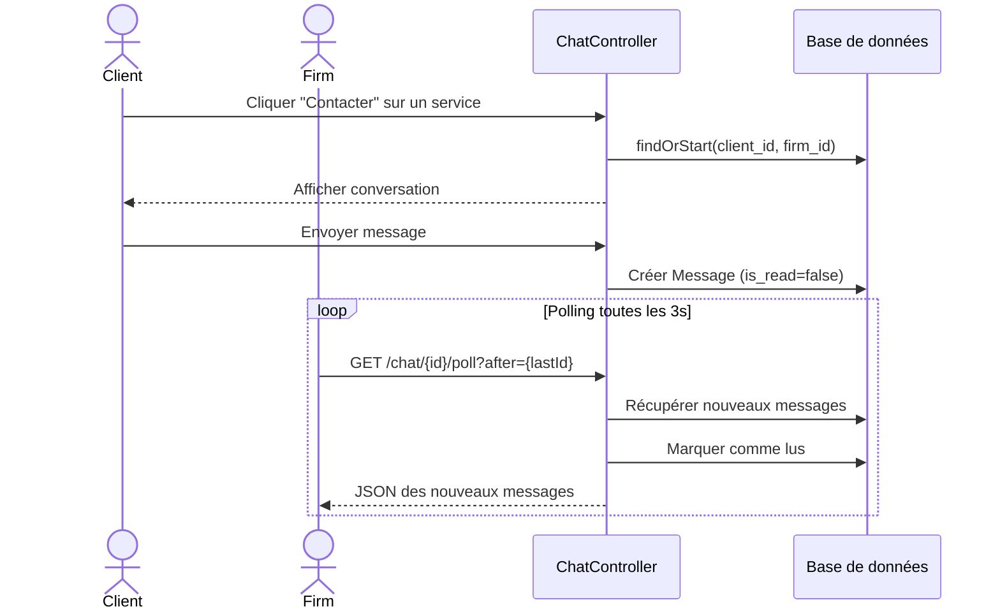

# Exknot — Documentation Technique

---

## 1. Description du Projet

**Exknot** est une plateforme marketplace B2B développée avec **Laravel 11**, permettant à des **cabinets d'expertise** (firms) de publier leurs services professionnels et à des **clients entreprises** de les consulter, les commander et les évaluer.

### Concept
Le nom **"Exknot"** (Expert + Knot) symbolise le lien noué entre les entreprises clientes et les cabinets d'expertise. Le slogan **"Tie the right knot"** incarne la mission de la plateforme : connecter la bonne expertise au bon besoin.

### Fonctionnalités principales

| Module | Description |
|--------|-------------|
| **Authentification** | Inscription, connexion, vérification email, réinitialisation mot de passe (Laravel Breeze) |
| **Gestion des profils** | Nom, email, entreprise, pays, bio, avatar |
| **Catalogue de services** | Recherche, filtrage par catégorie, tri par prix/date, pagination |
| **Panier** | Ajout, modification quantité, suppression (stocké en session) |
| **Commandes** | Passage de commande, historique, statuts (pending → validated / cancelled) |
| **Avis & Notes** | Système de notation 1-5 étoiles + commentaire par service |
| **Messagerie** | Chat en temps réel entre clients et firms (polling AJAX) |
| **Administration** | Gestion des utilisateurs, changement de rôles, suppression de comptes |

### Rôles utilisateur

| Rôle | Permissions |
|------|-------------|
| **Client** | Consulter services, commander, laisser des avis, messagerie |
| **Firm** | Publier/modifier/supprimer des services, gérer les commandes reçues, messagerie |
| **Admin** | Accès total : gestion utilisateurs, changement de rôles, tableaux de bord globaux |

### Stack technique

- **Backend** : PHP 8.2+ / Laravel 11
- **Frontend** : Blade Templates / Tailwind CSS / Alpine.js
- **Base de données** : MySQL
- **Authentification** : Laravel Breeze
- **Build** : Vite
- **Serveur** : WAMP

---

## 2. Diagramme UML — Diagramme de Classes



---

## 3. Schéma de Base de Données



### Résumé des tables

| Table | Colonnes clés | Relations |
|-------|---------------|-----------|
| `users` | name, email, role, company_name, country, bio, avatar | → products, orders, reviews, conversations, messages |
| `categories` | name, slug, description | → products |
| `products` | title, description, price, image, status | → user, category, reviews, order_items |
| `orders` | total, status, notes | → user, order_items |
| `order_items` | quantity, price | → order, product |
| `reviews` | rating (1-5), comment | → user, product |
| `conversations` | client_id, firm_id (unique pair) | → client, firm, messages |
| `messages` | body, is_read | → conversation, sender |
| `password_reset_tokens` | email, token | — |
| `sessions` | payload, last_activity | → user |

### Contraintes notables
- `users.email` → unique
- `categories.slug` → unique
- `conversations(client_id, firm_id)` → unique composite
- `messages(conversation_id, created_at)` → index composite
- Toutes les clés étrangères ont `ON DELETE CASCADE`

---

## 4. Explication de l'Architecture

### Architecture MVC (Model-View-Controller)

L'application suit strictement le pattern **MVC** de Laravel :



### Couche par couche

#### 1. Routes (`routes/web.php`)
Les routes sont organisées par **niveau d'accès** :

```
Routes publiques          → /, /services, /services/{id}, /privacy, /terms, /contact
Routes authentifiées      → /profile, /cart, /orders, /chat, /dashboard
Routes firm (firm,admin)  → /firm/dashboard, /firm/services/*, /firm/orders/*
Routes admin              → /admin/dashboard, /admin/users/*
```

#### 2. Middleware
| Middleware | Rôle |
|-----------|------|
| `auth` | Vérifie que l'utilisateur est connecté |
| `verified` | Vérifie que l'email est validé |
| `role:client,firm,admin` | Vérifie le rôle de l'utilisateur (accepte plusieurs rôles) |

#### 3. Controllers

| Controller | Responsabilité | Actions principales |
|-----------|---------------|---------------------|
| `ProductController` | Gestion des services (CRUD) | index, show, create, store, edit, update, destroy |
| `CartController` | Panier session | index, add, update, remove |
| `OrderController` | Commandes | index, show, store, cancel, updateStatus |
| `ReviewController` | Avis | store, destroy |
| `DashboardController` | 3 tableaux de bord | client(), firm(), admin() |
| `ChatController` | Messagerie | index, show, store, poll, start |
| `ProfileController` | Gestion profil | edit, update, destroy |
| `ContactController` | Formulaire contact | send |

#### 4. Models (Eloquent ORM)
Chaque model encapsule la logique métier et définit les relations :

- **User** : Modèle central avec 3 rôles, relations vers products, orders, reviews, conversations
- **Product** : Service publié par une firm, avec `averageRating()` calculé dynamiquement
- **Conversation** : Pattern de messagerie client↔firm avec `findOrStart()` (first-or-create)
- **Message** : Suivi de lecture avec `is_read` pour les notifications

#### 5. Views (Blade)
Organisation hiérarchique avec un **layout principal** (`layouts/app.blade.php`) et des sous-dossiers par fonctionnalité :

```
views/
├── layouts/app.blade.php       ← Layout principal (navbar, footer, Exknot branding)
├── welcome.blade.php           ← Landing page dynamique
├── dashboard.blade.php         ← Routeur de dashboard par rôle
├── dashboard/
│   ├── client.blade.php        ← Commandes récentes, avis, panier
│   ├── firm.blade.php          ← Services publiés, commandes reçues, revenus
│   └── admin.blade.php         ← Statistiques globales, gestion utilisateurs
├── services/
│   ├── index.blade.php         ← Catalogue avec recherche/filtres
│   ├── show.blade.php          ← Détail service + avis + bouton chat
│   ├── create.blade.php        ← Formulaire de création (firm)
│   └── edit.blade.php          ← Formulaire d'édition (firm)
├── cart/index.blade.php        ← Panier avec calcul total
├── orders/
│   ├── index.blade.php         ← Historique des commandes
│   └── show.blade.php          ← Détail d'une commande
├── chat/
│   ├── index.blade.php         ← Liste des conversations
│   └── show.blade.php          ← Thread de messagerie avec polling
├── profile/edit.blade.php      ← Édition du profil
└── pages/                      ← Pages statiques (privacy, terms, contact)
```

### Flux fonctionnels clés

#### Flux de commande


#### Flux de messagerie


### Sécurité

| Mécanisme | Implémentation |
|-----------|---------------|
| **CSRF** | Protection automatique Laravel sur tous les formulaires POST/PATCH/DELETE |
| **XSS** | Échappement automatique Blade avec `{{ }}` |
| **SQL Injection** | Requêtes paramétrées via Eloquent ORM |
| **Autorisation** | Middleware `role:...` + vérifications `auth()->id()` dans les controllers |
| **Validation** | `$request->validate()` sur toutes les entrées utilisateur |
| **Upload** | Validation MIME type + taille max (2MB) pour les images |

---

### Identité visuelle

| Élément | Valeur |
|---------|--------|
| **Nom** | Exknot |
| **Slogan** | *Tie the right knot.* |
| **Couleur fond** | `#0A0D12` (dark) |
| **Couleur accent** | `#1D9E75` (teal) |
| **Couleur texte** | `#E8EDF2` |
| **Police** | DM Sans (Google Fonts) |
